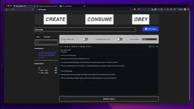

## CipherPage App https://cipher.page

The app is a react-redux message board with built in NaCL encryption using symmetric and asymmetric key management which only authorized parties can access to decrypt communications stored off-chain on IPFS.

## Video Demos

Initial Clips:

- [Demo Part 1](videos/Demo%20Part%201.webm)
- [Demo Part 2](videos/Demo%20Part%202.webm)
- [Demo Part 3](videos/Demo%20Part%203.webm)

# Newsletter Frontend

A frontend to handle asymmetric and symmetric key management between disparate parties. Users can create groups with the `newsletter_v0_1_0.aleo` contract and invite members to deliver issues (new content). Newsletters contain contents and template structure which is a loose representation of content. Privacy mode can be toggled on or off to show the cipher text of any given input.

## Project Frameworks

- Vite
- React
- Redux Toolkit
- @DemoxLabs Aleo Wallet Adapter
- Vitest
- Vite Plugin WASM Pack (leveraging snarkvm-wasm)
- Aleo

## Build and Run

`npm run` will list all commands from package.json. A simple `npm install` followed by `npm run wasm` and `npm run dev` will get you started running the frontend.

## Environment Variables

Here are the steps to set up the .env file and .env.local file:

1. Open the .env file.
2. Replace the placeholders with the correct values for your environment.
3. Save the changes.

Now, let's set up the .env.local file:

1. Copy the example from .env.local.example.
2. Create a new file named .env.local.
3. Paste the copied content into the .env.local file.
4. Modify the values as necessary.
5. Save the changes.

Note: The .env.local file is used for local development and is not checked into the repository.

For storing ciphertext of the offchain, set the following keys:

- VITE_INFURA_IPFS_API_KEY
- VITE_INFURA_IPFS_API_SECRET

The application uses Infura's IPFS gateway. You can get these keys/secrets by creating a free trial account on https://infura.io.

If you are using Vercel or another hosting platform, you will need to configure the environment variables as defined by these files. These files are currently ignored in git.

Remember, always tailor .env and .env.local to your specific needs.

# Checkout Newsletter Contract

Use `git submodule update --init --recursive` to checkout the newsletter contract.

# Run Tests

`cd ./aleo/newsletter && export PRIVATE_KEY="APrivateKey1zkp5YhYmi67oU8EWKvwkWF82RnVqqbNFRbicraJufz5XJM6"; make test`

I used examples with the private key from the program.example.json, so it may work for you to run all of the transitions rapid fire with the make file if you export that key as export PRIVATE_KEY ... and then run make test.
Otherwise you will have to modify the makefile.

## How to use the Application

There are 3 routes which can direct interaction with the Application:

### Create

Create a Newsletter/cipher.page This lets you manage a newsletter to invite other addresses to participate in. The newsletter starts with a template, which you can toggle to fill with content. There is a privacy toggle where at any time you can preview the cipher text of your work.

Users can invite members to created Newsletters

Users can update newsletters without delivering asymmetric cipher text of such to the members.

Users can deliver asymmetric content to IPFS to be accessed through network mappings by users which can then respond in kind.

### Consume

At any time the user can preview or consume newsletters they are a party to or have created in the past. This page can also be used in the moment before a network call to preview the resulting contents.

Manage subscriptions (accept/unsub)

Read issues (sent by calling deliver by any subscriber).

### Deploy/Obey

If the contract has yet to be deployed it can be done from this page when it says Deploy.

If it says Obey, the contract has been deployed and a link is provided to review code onchain.

### Components, Features, Lib, Pages

See TypeDoc generated documentation in docs folder. It is served on github pages at https://arosboro.github.io/newsletter-fe/

### Tests

A percentage of the application has coverage by integration testing so that it can be confirmed to be working, and rapidly deployed to production after tests pass. These are initiated through GitHub actions.
